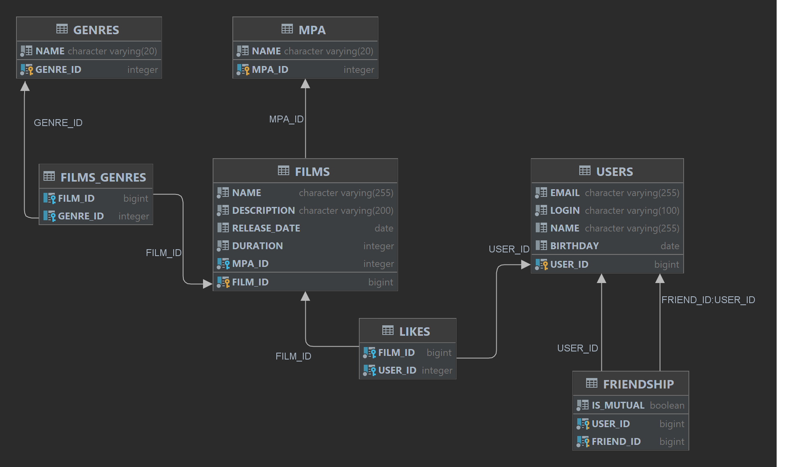

# java-filmorate
Template repository for Filmorate project.

## Примеры запросов

### Получить количество фильмов по каждому возрастному рейтингу
    SELECT mpa.name as Название_рейтинга, COUNT(*) as Количество
    FROM films f
    JOIN mpa ON mpa.mpa_id = f.mpa_id
    GROUP BY mpa.name;

### Получить ТОП-3(N) самых популярных фильма
    SELECT f.name as Название_фильма, COUNT(*) as Количество_голосов
    FROM films f
    JOIN likes l ON l.film_id = f.film_id
    GROUP BY f.name
    ORDER BY Количество_голосов DESC
    LIMIT 3(N);

### Узнать самого "дружелюбного" пользователя
    SELECT u.login as Логин, COUNT(*) as Количество_друзей 
    FROM users u
    JOIN friendship fs ON fs.user_id = u.user_id
    GROUP BY u.login
    HAVING fs.is_mutual = true
    ORDER BY Количество_друзей DESC
    limit 1;
